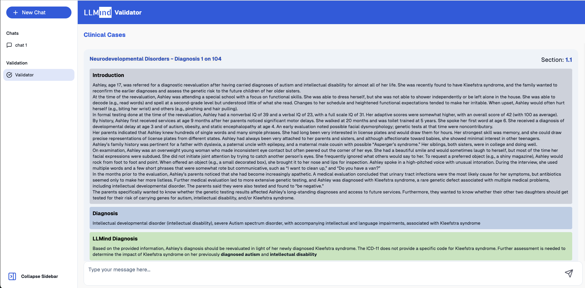
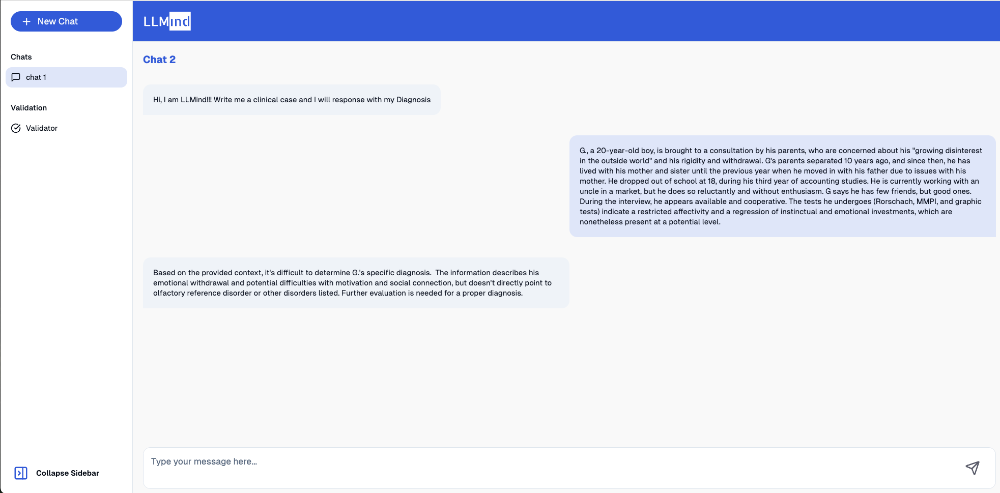

# LLMind

LLMind Chat leverages a Retrieval Augmented Generation (RAG) model based on the Gemma 2, specifically adapted to the context of the ICD-11. This RAG model combines the strengths of Gemma 2 with a comprehensive knowledge base derived from the ICD-11, allowing it to access and process relevant information from the classification manual in real-time.
LLMind's diagnostic accuracy was rigorously evaluated against the DSM-5-TR Clinical Cases manual, using automated metrics and mental health professionals' expert validation. The results demonstrate its potential as a reliable and valid support tool for clinicians. The system is based on large language models and provides two distinct chat modes: **Normal Chat** and **Validation Chat**.

- **Normal Chat**: Allows the user to interact with the chatbot and discuss clinical cases, where the model provides a potential diagnosis and reasoning.
- **Validation Chat**: Presents the user with a clinical case, including both the true diagnosis and the model’s diagnosis. The user is tasked with evaluating the model's performance by providing a score and an optional note.

## Features

### 1. **Normal Chat**:

- Users can engage with LLMind in an open conversation about a clinical case.
- LLMind will provide possible diagnoses based on the symptoms, medical history, and other details shared by the user.
- It can explain the rationale behind each diagnosis, including likely tests, treatments, or considerations for further steps.

### 2. **Validation Chat**:

- The system presents the user with a clinical case, including the **true diagnosis** and the **model’s diagnosis**.
- The user evaluates the model's diagnosis by comparing it with the true diagnosis.
- The user provides a **score** (e.g., 0 to 1) based on the model’s accuracy and an **optional note** to elaborate on the score, explaining why the model's response was correct, partially correct, or incorrect.
- This feature allows users to provide feedback and helps to refine the model's accuracy over time.

## Installation

To use LLMind locally, follow these instructions:

### Requirements:

- Docker Installed

### Step-by-Step Guide:

1. Clone the repository:

   ```bash
   git clone https://github.com/unimib-whattadata/llmind-chat.git
   cd llmind-chat
   ```

2. Create and run Docker containers:

   ```bash
   docker compose up
   ```

3. Open the provided link in your browser to start interacting with LLMind (e.g. http://localhost:3001).

## Usage

1. **Start a normal chat**:

   - In the chat interface, select the **New Chat** button to begin discussing a clinical case.
   - Provide a clinical case with the corresponding symptoms, medical history, and any relevant information.
   - LLMind will give a diagnosis and the rationale behind it.

2. **Start a validation chat**:
   - Choose the **Validation Chat** option in the left sidebar.
   - LLMind will provide you: a clinical case, the correct diagnosis and the diagnosis generated by LLMind.
   - The user should provide a score and then if needed a note.

## User Interface




## License

This project is licensed under the MIT License - see the [AGPL-3.0](LICENSE) file for details.
